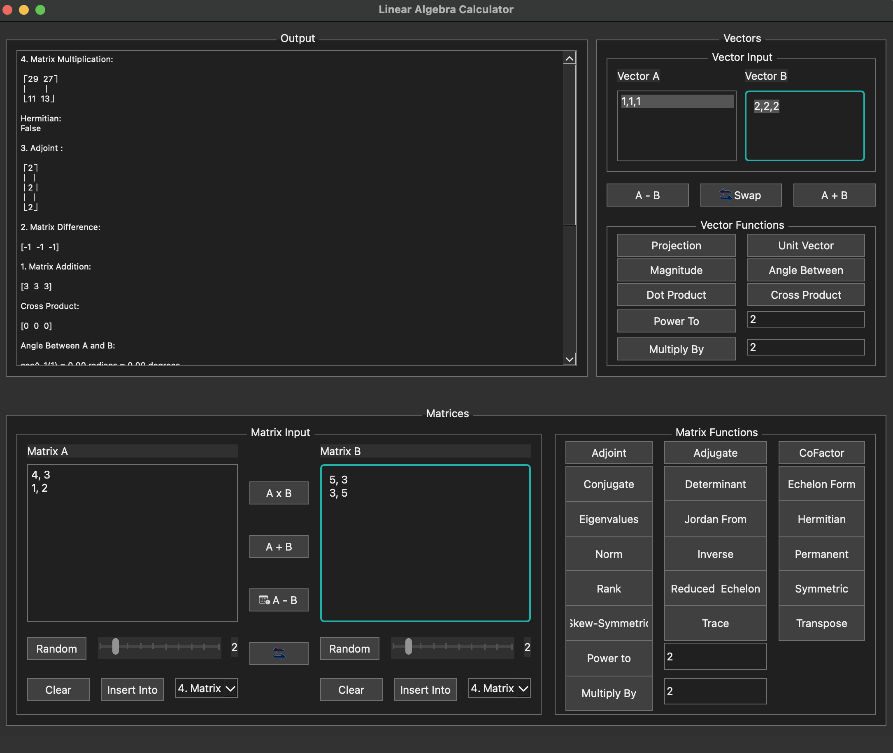

# Linear Algebra Calculator

A powerful and lightweight desktop tool for performing linear algebra operations on vectors and matrices. Built with Python and Qt (PySide6), it offers an interactive interface to compute various vector and matrix functions.



---

## ✨ Features

- Vector operations:
  - Addition, subtraction, dot product, cross product
  - Magnitude, unit vector, projection, angle between
  - Scalar multiply and element-wise power

- Matrix operations:
  - Addition, subtraction, multiplication
  - Determinant, inverse, adjoint, adjugate
  - Rank, transpose, conjugate, cofactor, permanent
  - Echelon and reduced row echelon form
  - Eigenvalues, Jordan form
  - Symmetry, Hermitian, skew-symmetric checks
  - Scalar multiply and element-wise power

- Input:
  - Fractional and float input parsing (e.g., `1/2`, `0.5`)
  - Random matrix generation
  - Combobox history for reusing previous results

---

## 🚀 Installation

### Requirements

- Python 3.10+
- pip

### Dependencies

Install required packages:

```bash
pip install -r requirements.txt
````

> Or manually:

```bash
pip install PySide6 sympy numpy
```

---

## 🖥️ Usage

Run the app:

```bash
python mainwindow.py
```

You’ll see a window with input areas for matrices and vectors, operation buttons, and an output display.

* Input matrices in CSV format:

  ```
  1, 2
  3, 4
  ```

* Input vectors as:

  ```
  1,1,1
  ```

Use the buttons to perform operations. Output appears in the scrollable output box.

---

## 🛠️ Built With

* [PySide6](https://doc.qt.io/qtforpython/) – Qt for Python (GUI)
* [SymPy](https://www.sympy.org/) – symbolic math engine
* [NumPy](https://numpy.org/) – array formatting and type conversions

---

## 🪪 License

MIT License. See `LICENSE` file for more details.
